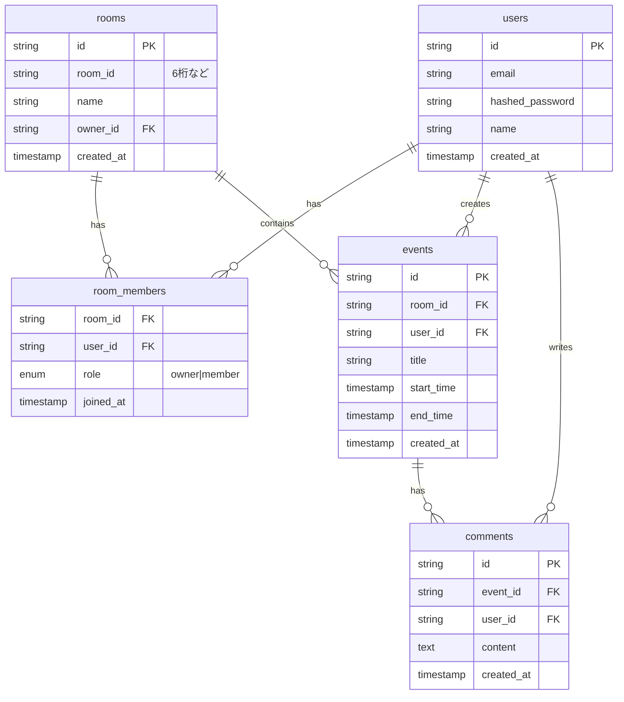

# PlayStatus 仕様書

オンラインゲームやスポーツの練習をする友達同士で、誰が今プレイしているか・する予定かを共有できるWebアプリの仕様を定義する。

---

## 1. 概要

### 1.1 目的
友達同士でプレイ予定を共有し、カレンダー上でいつ誰が何をするか把握できるようにする。

### 1.2 主な機能
- ルームの作成・参加（ルームIDで招待）
- カレンダーによる予定の表示・追加・編集・削除
- 予定へのコメント（例：「自分も行きます」）
- ルームメンバー管理（owner によるメンバー削除・ルーム削除）

---

## 2. 技術スタック

| レイヤー | 技術 |
| --- | --- |
| フロント/API | Next.js 14+ (App Router) + TypeScript |
| データベース | Neon (PostgreSQL) |
| ORM | Drizzle ORM |
| デプロイ | Vercel |
| 認証 | NextAuth.js (Credentials: メール/パスワード) |

### 2.1 設計方針
- データ更新はリアルタイム反映せず、画面上の「更新」ボタンで手動再取得する

---

## 3. UI・デザイン方針

| 項目 | 方針 |
| --- | --- |
| レスポンシブ | モバイル・デスクトップ両方で操作性重視のレイアウト |
| テーマ | ダークテーマ（暗色背景、明色テキスト） |
| スタイル | シンプルでモダン、余白とフォントを活かした見やすいUI |

---

## 4. 機能仕様

### 4.1 認証

| 項目 | 仕様 |
| --- | --- |
| サインアップ | メール、パスワード、表示名で登録 |
| ログイン | メール/パスワードでログイン |
| パスワード | bcrypt でハッシュ化して保存 |
| セッション | NextAuth.js で管理 |

### 4.2 ルーム

| 項目 | 仕様 |
| --- | --- |
| 作成 | ログイン済みユーザーがルーム名を入力 → 6桁のルームID（例: `ABC123`）を自動生成し、作成者を owner として登録 |
| 参加 | ルームIDを入力 → `room_members` に member として追加 |
| ロール | owner / member の2種類 |

**owner 権限**
- ルーム名の変更
- メンバー削除（`room_members` から削除）
- ルーム削除（関連する events, comments も削除）

**member 権限**
- ルーム内のイベント閲覧・追加・編集・削除（自分のもののみ）
- コメントの閲覧・追加・編集・削除（自分のもののみ）

### 4.3 カレンダー

| 項目 | 仕様 |
| --- | --- |
| 表示 | 月表示のカレンダーUI（react-big-calendar または @fullcalendar/react） |
| データ | ルームに紐づくイベントを取得して表示 |
| 予定追加 | 日付クリックまたは「予定追加」ボタンでフォーム表示 |

### 4.4 イベント（予定）

| 項目 | 仕様 |
| --- | --- |
| 入力項目 | タイトル（ゲーム名・練習場所）、開始時刻、終了時刻 |
| 編集 | 作成者本人のみ可能 |
| 削除 | 作成者本人のみ可能 |
| 表示範囲 | ルームIDで絞り込み |

### 4.5 コメント

| 項目 | 仕様 |
| --- | --- |
| 表示 | 各イベントにコメント一覧を表示 |
| 追加 | テキスト入力 + 送信で保存 |
| 編集 | 投稿者本人のみ可能 |
| 削除 | 投稿者本人のみ可能 |

### 4.6 更新ボタン

| 項目 | 仕様 |
| --- | --- |
| 配置 | カレンダー画面のヘッダー付近、イベント詳細モーダル内のコメント一覧 |
| 動作 | クリック時に `router.refresh()` で Server Component を再実行し、最新データを再取得 |
| コメント一覧 | イベント詳細内の「更新」でコメントのみ再取得可能 |

---

## 5. データモデル

### 5.1 ER図



### 5.2 テーブル定義

**users**
| カラム | 型 | 説明 |
| --- | --- | --- |
| id | string (PK) | UUID |
| email | string | メールアドレス（ユニーク） |
| hashed_password | string | ハッシュ化されたパスワード |
| name | string | 表示名 |
| created_at | timestamp | 作成日時 |

**rooms**
| カラム | 型 | 説明 |
| --- | --- | --- |
| id | string (PK) | UUID |
| room_id | string | 6桁の参加用ID（ユニーク） |
| name | string | ルーム名 |
| owner_id | string (FK) | 作成者ユーザーID |
| created_at | timestamp | 作成日時 |

**room_members**
| カラム | 型 | 説明 |
| --- | --- | --- |
| room_id | string (FK) | ルームID |
| user_id | string (FK) | ユーザーID |
| role | enum | owner / member |
| joined_at | timestamp | 参加日時 |

**events**
| カラム | 型 | 説明 |
| --- | --- | --- |
| id | string (PK) | UUID |
| room_id | string (FK) | ルームID |
| user_id | string (FK) | 作成者ユーザーID |
| title | string | タイトル（ゲーム名・練習場所） |
| start_time | timestamp | 開始時刻 |
| end_time | timestamp | 終了時刻 |
| created_at | timestamp | 作成日時 |

**comments**
| カラム | 型 | 説明 |
| --- | --- | --- |
| id | string (PK) | UUID |
| event_id | string (FK) | イベントID |
| user_id | string (FK) | 投稿者ユーザーID |
| content | text | コメント本文 |
| created_at | timestamp | 作成日時 |

---

## 6. 権限一覧

| 操作 | owner | member |
| --- | --- | --- |
| ルーム名変更 | ○ | × |
| メンバー削除 | ○ | × |
| ルーム削除 | ○ | × |
| イベント追加 | ○ | ○ |
| イベント編集（自分のもの） | ○ | ○ |
| イベント削除（自分のもの） | ○ | ○ |
| コメント追加 | ○ | ○ |
| コメント編集（自分のもの） | ○ | ○ |
| コメント削除（自分のもの） | ○ | ○ |

---

## 7. ディレクトリ構成

```
PlayStatus/
├── src/
│   ├── app/
│   │   ├── (auth)/          # ログイン・サインアップ
│   │   ├── (dashboard)/     # ルーム一覧、ルーム参加
│   │   └── room/[roomId]/   # カレンダー、イベント、コメント
│   ├── components/
│   │   ├── calendar/
│   │   ├── event-form/
│   │   └── comments/
│   ├── lib/
│   │   ├── db.ts            # Neon (Drizzle ORM)
│   │   └── auth.ts          # NextAuth 設定
│   └── server/
│       ├── actions/         # Server Actions (CRUD)
│       └── api/             # API Routes（必要に応じて）
├── drizzle/                 # マイグレーション
└── docs/
    └── SPEC.md              # 本仕様書
```

---

## 8. 主要ファイルと責務

| ファイル | 役割 |
| --- | --- |
| `src/lib/db.ts` | Neon 接続 + Drizzle ORM 初期化 |
| `src/lib/auth.ts` | NextAuth 設定（Credentials + セッション） |
| `src/server/actions/room.ts` | ルーム作成・参加・ルーム名変更・削除・メンバー削除 |
| `src/server/actions/event.ts` | イベント CRUD（編集・削除は作成者のみ） |
| `src/server/actions/comment.ts` | コメント CRUD（編集・削除は投稿者のみ） |
| `src/app/room/[roomId]/page.tsx` | カレンダー表示 + イベント詳細 + 更新ボタン |
| `src/components/calendar/*` | カレンダー UI + 更新ボタンによる再取得 |

---

## 9. 環境変数

```env
# Neon
DATABASE_URL=postgresql://...

# NextAuth
NEXTAUTH_SECRET=...
NEXTAUTH_URL=http://localhost:3000
```

---

## 10. 実装の順序

1. プロジェクトセットアップ（Next.js, Drizzle, Neon 接続）
2. 認証（サインアップ・ログイン）
3. ルーム CRUD（作成・参加・ルーム名変更・削除・メンバー削除）
4. イベント CRUD（カレンダー表示 + 予定追加・編集・削除）
5. コメント（イベント詳細へのコメント追加・編集・削除）
6. 更新ボタン（カレンダー・コメント一覧への配置）
7. デプロイ（Vercel + Neon 本番DB接続）
